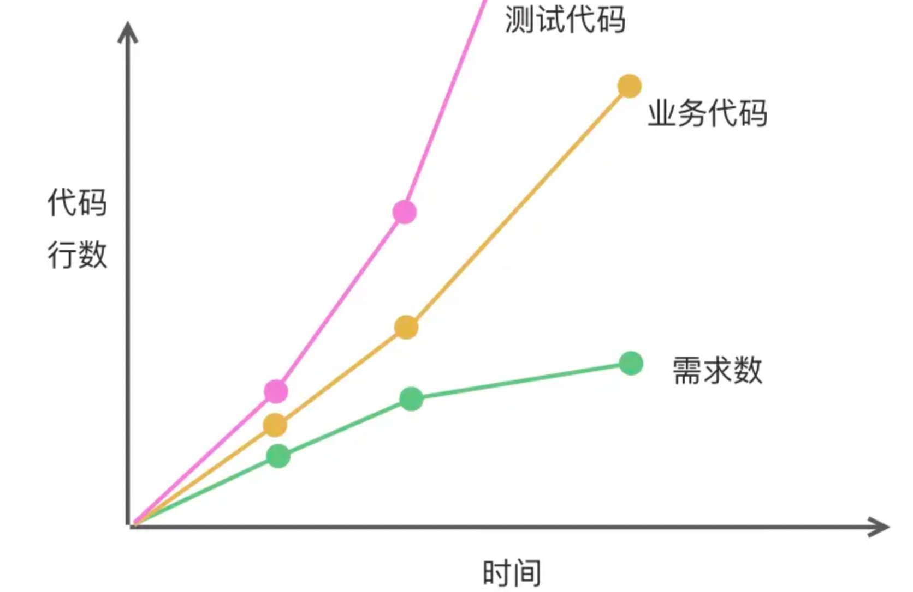

# 具体实践原则

---

1. 不要单纯的做开发，学会“偷懒”； --- 时刻想着提效
   1) 每天开发3～4万行代码，3年10万代码，质变达成量变； 关注代码最佳实践
   组件封装；设计模式；
   2) 工程维度：项目搭建、公共配置、组件库开发、技术选型
      1) 基于脚手架 + 组件库
      2) 公共业务模块整体划分，登陆模块统一规划(应对升级风险、统一入口)
   3) 业务线维度： 团队项目的整合、项目提效、技术方案
      单个活动页开发 -> 建站工具 + jquery -> 建站工具+小程序

2. 全面了解团队业务，做一个合格的“消防员”：
   1. 项目轮换 
   2. 技术分享：遇到的问题；研究的技术点等 
   3. 年末总结和扩展：头脑风暴(小范围)

3. 稳重求优，追求极致 
   1. 技术债务 （可恨不可怕）
   2. 制定计划，影响范围尽可能心中有数
   3. 小步快跑的方式，逐步优化
   《clean code》《重构》优秀书籍可以看一看
   
 

4. 密切关注前沿技术，“武装”就是一种修养  - 磨刀不误砍柴工
   1. 关注最新技术点和发展方向，反哺业务开发
      https://stateofjs.com/en-us/
   2. 关注业界大佬的微博：尤小右 winter等

